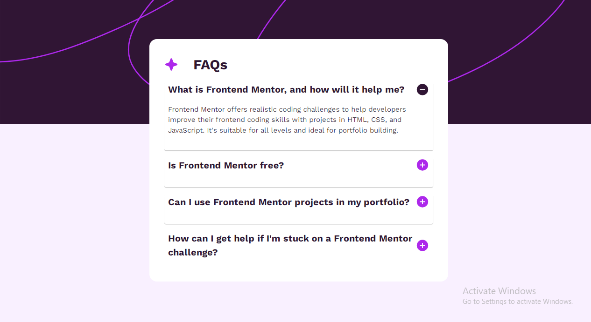

# Frontend Mentor - FAQ accordion solution

This is a solution to the [FAQ accordion challenge on Frontend Mentor](https://www.frontendmentor.io/challenges/faq-accordion-wyfFdeBwBz). Frontend Mentor challenges help you improve your coding skills by building realistic projects.

## Table of contents

- [Overview](#overview)
  - [The challenge](#the-challenge)
  - [Screenshot](#screenshot)
  - [Links](#links)
- [My process](#my-process)
  - [Built with](#built-with)
  - [What I learned](#what-i-learned)
  - [Continued development](#continued-development)
  - [Useful resources](#useful-resources)
- [Author](#author)
- [Acknowledgments](#acknowledgments)

## Overview

### The challenge

Users should be able to:

- Hide/Show the answer to a question when the question is clicked
- Navigate the questions and hide/show answers using keyboard navigation alone
- View the optimal layout for the interface depending on their device's screen size
- See hover and focus states for all interactive elements on the page

### Screenshot



### Links

- Solution URL: [Add solution URL here](https://your-solution-url.com)
- Live Site URL: [faq-accordion](https://caleb-abuul.github.io/faq-accordion/)

## My process

### Built with

- Semantic HTML5 markup
- CSS custom properties
- Flexbox
- CSS Grid

### What I learned

I learnt how to use `<picture>` to change image `src` value depending on screen size

To see how you can add code snippets, see below:

```html
<picture>
  <source media="(width: 375px)" srcset="mobile-img.png" />
  <source media="(min-width: 376px)" srcset="desktop-img.png" />
  
</picture>
```

### Continued development

Going forward, I would like to learn to make my webpages more accessible.

### Useful resources

While working on this project, I didn't quite consult a ton of resources, I just relied on previous knowledge and put my thoughts on paper before writing the code. and each time i got stuck, I would step back and come back at a later time with a fresh and new way of tackling the challenge.

By writing down my thoughts and thinking through what I wanted to do, I was figure thngs out, maybe not in the best way possible, but i did write the code and it ran :astonished:.

## Author

- Github - [Caleb Abuul](https://github.com/Caleb-Abuul)
- Website - [Caleb](https://https://caleb-abuul.github.io/caleb/)
- Frontend Mentor - [@Caleb-Abuul](https://www.frontendmentor.io/profile/Caleb-Abuul)
- Twitter - [@CalebAbuul](https://www.twitter.com/CalebAbuul)
- LinkedIn - [@Caleb Abuul](www.linedin.com/in/caleb-abuul)

## Acknowledgments

Though I didn't consult much external resources for this project, the wisdom of [Kevin Powell](https://github.com/kevin-powell) was a constant guide through out the project. He has been a great inspiration through his [YouTube Channel](https://youtube.com/@KevinPowell?si=Yhw2-yrCyeetnmys). He has tons of videos spanning several topics in CSS on YouTube. Please do well to check him out [Kevin Powell](https://youtube.com/@KevinPowell?si=Yhw2-yrCyeetnmys)
